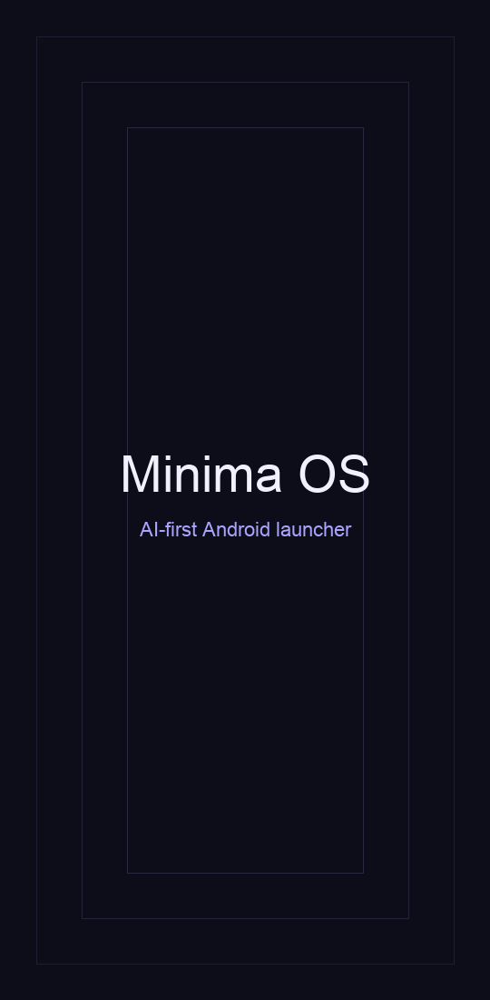

# Minima OS

<p align="center">
  
</p>

An AI-first Android launcher. No app grid. No home screen. Just a clock, a command bar, a memory, and a voice.

You tell Minima what you want in natural language — "text Sarah I'm running late", "remind me to call mom at 6", "weather in Dubai", "turn on the flashlight", "schedule meeting with Ali tomorrow" — and it figures out the intent, executes the task, and remembers anything worth remembering.

Tap the mic to go hands-free: Minima listens, executes, and speaks the result back in a natural voice. Ask a follow-up without tapping again.

## Features

- **21 intents** — open app, call contact, text, email, calendar read/write, set alarm, reminder, DnD, navigate, search, translate, math, joke, flashlight, camera, music control, weather, unit/currency convert, notification triage, remember, recall, answer
- **Multi-provider LLM** — choose between OpenAI, Groq (free tier), DeepSeek, OpenRouter, Anthropic Claude, or Google Gemini. Per-provider API keys stored locally.
- **OODA auto-tune** — the launcher watches itself. Every 30 tasks it analyzes outcomes by intent/provider/voice-vs-text and proposes one parameter change. Attribution across batches detects regressions and auto-rolls-back. Three modes: log-only, auto-safe, or ask-me.
- **AI-first intent classification** — LLM leads, deterministic patterns as fallback, `ANSWER` catch-all so nothing ever returns "didn't understand"
- **3-tier memory** — STM (48h) → MTM (30d) → LTM (permanent), auto-promotion based on access patterns
- **Personal knowledge graph** — people, places, patterns, preferences extracted from completed tasks
- **AI-driven context surface** — insight cards generated from your memory + time context
- **AI-driven proactive layer** — morning briefs, nudges, people reminders; learns from dismissals
- **Voice mode** — SpeechRecognizer STT + TextToSpeech TTS, natural LLM-generated spoken replies, conversation follow-up mode, auto-retry on "didn't catch that"
- **Fuzzy app matching** — Levenshtein edit distance, handles typos and misspellings
- **3 sensitivity modes** — Quiet (1 card), Normal (3), Proactive (5)

## Screenshots

See the intro above, or browse `docs/` for full-resolution stills.

## Architecture

7 Gradle modules, Hilt DI throughout:

```
app         → Application, MainActivity, Hilt entry point, DI wiring
ui          → Jetpack Compose screens (launcher, memory, settings, voice)
agent       → TaskExecutor, IntentClassifier, DeterministicPlanner, orchestration
capability  → Pluggable action handlers (system, calendar, messaging, weather,
               alarm, contacts, convert, notification, memory, chat, commerce)
data        → Room database, MemoryManager, ContextEngine, ProactiveEngine
model       → CloudModelProvider (multi-provider HTTP), ModelProvider interface
core        → Shared models (Intent, Task, StepResult, ActionStep)
```

See `ARCHITECTURE.md` for the full diagram.

## Build

Requires Android Studio / JDK 17+ and Android SDK.

```bash
export JAVA_HOME="/Applications/Android Studio.app/Contents/jbr/Contents/Home"
export ANDROID_HOME="$HOME/Library/Android/sdk"
./gradlew :app:assembleDebug
```

APK output: `app/build/outputs/apk/debug/app-debug.apk`

## Install

```bash
adb install -r app/build/outputs/apk/debug/app-debug.apk
adb shell monkey -p com.minima.os -c android.intent.category.LAUNCHER 1
```

Press Home and select Minima as the default launcher.

## Setup

Minima needs an API key from any supported LLM provider to use smart features. Without a key, it falls back to deterministic keyword matching.

**In-app** (recommended):
1. Long-press anywhere on the home screen → Settings
2. Pick a provider: OpenAI, Groq, DeepSeek, OpenRouter, Anthropic, or Gemini
3. Paste your API key
4. (Optional) Override the model name
5. Save

Keys are stored locally in app-private SharedPreferences and sent only to the provider you selected.

### Supported providers

| Provider | Default Model | Notes |
|---|---|---|
| OpenAI | `gpt-4o` | Reliable, paid |
| Groq | `llama-3.3-70b-versatile` | Free tier, very fast |
| DeepSeek | `deepseek-chat` | Cheap, strong reasoning |
| OpenRouter | `openai/gpt-4o-mini` | Aggregator, many models |
| Anthropic Claude | `claude-3-5-sonnet-20241022` | Strong at nuance |
| Google Gemini | `gemini-2.0-flash` | Fast, multimodal |

## Permissions

Minima requests only what it needs for the features you use:

| Permission | Used for |
|---|---|
| `RECORD_AUDIO` | Voice commands (mic button) |
| `QUERY_ALL_PACKAGES` | Launcher function — listing installed apps |
| `CAMERA` / `FLASHLIGHT` | Camera capture, torch control |
| `READ_CALENDAR` / `WRITE_CALENDAR` | Read events, create new events |
| `READ_CONTACTS` | Call by name |
| `SEND_SMS` / `READ_SMS` | Send messages, read recent messages |
| `CALL_PHONE` | Dial a contact |
| `SET_ALARM` | Set alarms and timers |
| `POST_NOTIFICATIONS` | Show task status notifications |
| `INTERNET` | LLM provider + weather API calls |

The `BIND_NOTIFICATION_LISTENER_SERVICE` must be granted manually in Android Settings → Apps → Notifications → Notification access.

## Privacy

- Every command you send (and relevant memory context) is forwarded to the LLM provider you select.
- Memory is stored locally in a Room database. No cloud sync.
- No analytics, no telemetry, no crash reports (yet).
- API keys never leave your device except as `Authorization` headers to your chosen provider's endpoint.

## Contributing

See `CONTRIBUTING.md`. PRs welcome — file an issue first for anything non-trivial.

## Security

To report a vulnerability, see `SECURITY.md`.

## OODA auto-tune

Minima ships with a self-tuning loop ported from the `autoresearch` pattern in the supermeme trading bot. Every 30 task outcomes (or manually via "Run now" / "debug seed-ooda"), it:

1. **Observes** — logs each outcome (intent, provider, confidence, latency, voice flag, success, error) into the `task_outcomes` Room table.
2. **Orients** — buckets outcomes by intent, provider, and voice-vs-text; computes success rate and avg latency per bucket.
3. **Decides** — runs 7 priority-ordered rules; first match wins (one change per batch). Attribution from the previous batch compares the new success rate to the pre-apply baseline.
4. **Acts** — logs a `TuningChangeEntity` proposal. Behavior depends on apply mode:
   - **LOG_ONLY** (default): proposal is recorded; no runtime change.
   - **AUTO_SAFE**: proposal is applied if the param is whitelisted and delta is bounded (e.g. voice timeout ±1.5s, temperature ±0.2). If the next batch regresses >10 pp, the change is auto-rolled back.
   - **HUMAN_QUEUE**: proposal appears as a badge on the home screen ("N tunes"); tap → dashboard → Apply/Dismiss.

**Live tunables**: `voice_timeout_ms`, `provider_default`, `temperature`, `llm_rewrite_skip_intents`.

**Dashboard**: type `auto-tune` or `debug ooda` in the command bar. Shows success-rate sparkline, dimension breakdowns, recent changes, per-proposal Apply/Dismiss buttons, and a "Run now" trigger.

**Tests**: `./gradlew :data:testDebugUnitTest` covers each rule with plain JVM JUnit tests (see `data/src/test/java/com/minima/os/data/ooda/OodaRulesTest.kt`).

## Status

- [x] v1 — intent classification, 13 capabilities, cloud model
- [x] v2 — memory OS, context engine, proactive layer
- [x] v2.5 — multi-provider LLM, voice input/output, 21 intents, portrait lock
- [x] v3 — OODA auto-tune loop (observe/orient/decide/act, attribution + rollback, dashboard)
- [ ] v4 — on-device Gemma model, multimodal, widget surface, wake word

## License

MIT — see `LICENSE`.
